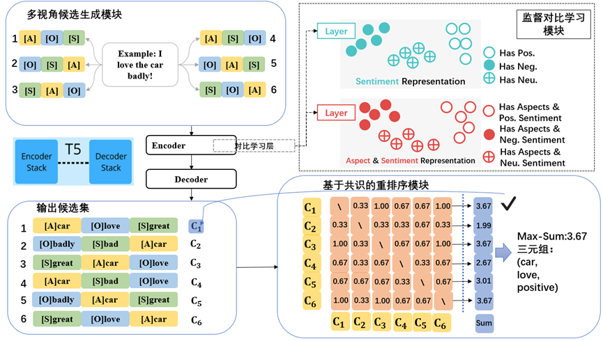
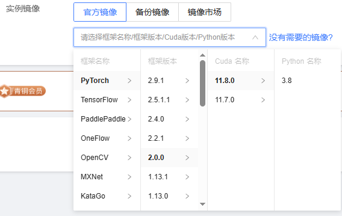
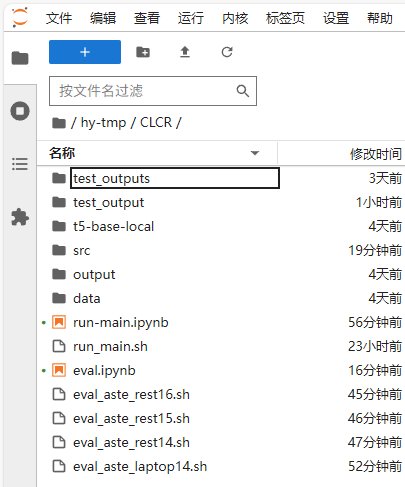
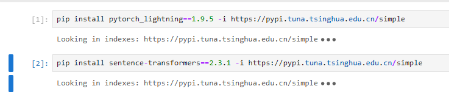

# Contrastive Learning and Consensus-based Reranking（CLCR）

## 1.项目介绍

​	本文提出的CLCR模型是一个基于多视角提示的生成式框架，该模型以T5这一强大的编码器-解码器架构为骨干，整体框架如图2所示。模型主要分为三大模块：多视角候选生成模块、监督对比学习模块、基于共识的重排序模块。多视角候选生成模块通过多种元素顺序提示，为同一个输入句子生成一组多样的候选三元组。监督对比学习模块通过在编码器端引入监督对比学习目标，让模型学习更具辨识度的语义表征。基于共识的重排序模块采用基于共识的重排序策略，通过计算候选输出池中各输出间的成对相似度总和来评估其共识度，并鲁棒地选出最优的三元组。

代码地址：通过网盘分享的文件：CLCR.zip
链接: https://pan.baidu.com/s/19r5AEssnFvQcjiZJmAJgrg?pwd=mnye 提取码: mnye  

该代码包含t5-base基础模型（训练时下载到本地的模型，不需下载也可以，直接在run_main.sh文件下把--model_name_or_path 后面的路径改成t5-base即可）和四个训练好的子模型、以及全部的代码。

t5-base和4个训练好的模型占了4个G左右的空间，实际核心代码没有很多。

## 2.环境要求

### 1.在云服务器上镜像选择：PyTorch-2.0.0，Cuda-11.8.0，Python-3.8

### 2.启动实例后打开Jupyter界面，在合适的地方上传整个CLCR文件夹。约4.3G，上传需要时间

t5-base-local是从官网下载到本地的t5-base模型，不下载也可以，只需要修改对应的路径即可。

### 3.打开src目录下，找到“安装的部分需求-首要.ipynb”文件，打开后运行以下两条代码。

## 3.代码训练

1.在CLCR目录下打开“run-main.ipynb“文件和”run_main.sh“文件。

2.在”run_main.sh“文件中修改TASK_DATA[aste]的值依次为四个数据集的值。之后在下方for SEED in 1 2 3 4 5 处可修改随机种子的值。

3.在“run-main.ipynb“文件中点击运行，即可开始训练。

4.训练结果在outputs文件夹的result.txt中。每个数据集和随机种子的结果都保存在了不同的位置，对应打开即可。

路径其一如下所示：

CLCR/outputs/aste/laptop14/top6_post_data1.0_seed13/result.txt

## 4.代码复现

由于不同的随机种子设置会导致不同的结果，本人在此针对四个子数据集训练好了对应的四个模型。

模型存放位置为output文件夹中，每个子数据集中都有一个训练好的模型，在final文件夹下，其余为训练时的日志。

路径之一：CLCR/output/aste/rest15/top6_post_data1.0_seed9/final

### 复现流程

1.在在CLCR目录下打开“eval.ipynb“文件。

2.依次执行四条代码，即可得到复现结果。

3.复现的测试日志保存在test_output文件夹中，测试的结果result.txt保存在output中。

测试日志路径之一：CLCR/test_output/aste/rest15/top6_post_data1.0_seed9/test.log

测试结果的result.txt路径之一：CLCR/output/aste/laptop14/top6_post_data1.0_seed151/result.txt

> [!NOTE]
>
> **原论文复现结果由于之前的显卡不能用了，相关训练好的模型没有保存，以下是这次的复现结果。每个F1值都比原论文中高1个点左右，可见原论文结果的可靠性。**

**复现结果如下：**

**laptop14:**  

**seed: 151, beam: 1, constrained: True**
**test consensus precision: 66.36 recall: 65.62 F1 = 65.99**

**rest14:**
**seed: 23, beam: 1, constrained: True**
**test consensus precision: 74.80 recall: 77.06 F1 = 75.92**

**rest15:**
**seed: 9, beam: 1, constrained: True**
**test consensus precision: 65.21 recall: 70.72 F1 = 67.85**

**rest16:**
**seed: 5, beam: 1, constrained: True**
**test consensus precision: 73.21 recall: 77.63 F1 = 75.35**

